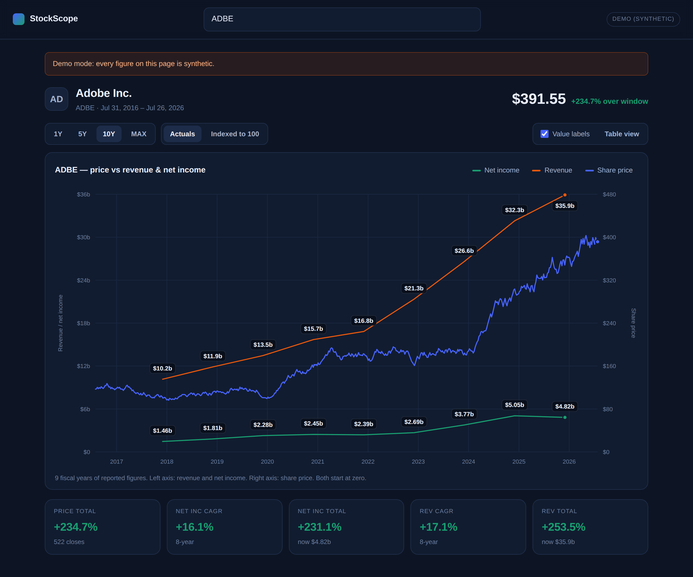

# StockScope

Search any stock ticker and see its price charted against the business underneath
it — annual revenue and net income on the same frame.



- **Search** by ticker or company name, with type-ahead.
- **One chart, three series** — weekly share price, plus revenue and net income
  at each fiscal year end, each annual point labelled with its value.
- **Crosshair readout** giving the price on that date and the fiscal-year figures
  in effect at the time.
- **Ranges** 1Y / 5Y / 10Y / MAX, an **Indexed to 100** scale, a **table view** of
  the reported figures, and a summary row of CAGR and total-growth stats.
- **No build step and no dependencies.** Node 18+, `npm start`, done.

## Quick start

```bash
cd stockscope
npm start           # http://127.0.0.1:3000 — real data from Yahoo, no API key
```

Or, with no network and no key at all:

```bash
npm run demo        # synthetic data, clearly labelled as such in the UI
```

## Data sources

The provider is chosen by `DATA_SOURCE`; left unset it prefers whichever keyed
provider is configured and falls back to Yahoo.

| Source | Env | Key | Price history | Annual financials |
|---|---|---|---|---|
| Yahoo Finance *(default)* | `DATA_SOURCE=yahoo` | none | decades | **~4 years** |
| Financial Modeling Prep | `DATA_SOURCE=fmp` + `FMP_API_KEY` | yes | decades | 10+ years |
| Alpha Vantage | `DATA_SOURCE=alphavantage` + `ALPHAVANTAGE_API_KEY` | yes | decades | ~5 years |
| Demo | `DATA_SOURCE=demo` | none | synthetic | synthetic |

**The caveat that matters:** Yahoo's free fundamentals endpoint returns only about
four annual periods. You get a full 10-year price line next to a four-point
revenue line. For the deep history the reference design shows, set `FMP_API_KEY`:

```bash
FMP_API_KEY=your_key npm start
```

Other settings:

| Variable | Default | Meaning |
|---|---|---|
| `PORT` / `HOST` | `3000` / `127.0.0.1` | listen address |
| `FMP_BASE_URL` | FMP v3 | override if your key is on a different API generation |
| `DEMO_FALLBACK` | off | when on, upstream failures serve synthetic data instead of an error |

`DEMO_FALLBACK` is off on purpose. Silently swapping invented numbers in for real
ones is the worst thing a finance chart can do; when it is on, the response is
still flagged and the UI keeps a banner up.

## How it reads

Both y-axes start at zero, so neither is stretched to make the lines appear to
"cross" somewhere flattering. Dual-axis charts can imply a relationship that
isn't in the data — that comparison is the whole point of this view, so it is the
default, but the **Indexed to 100** toggle rebases every series onto one axis when
you want the honest version. A series that starts the window at a loss cannot be
rebased and is dropped from that view rather than plotted in raw dollars on an
index axis; the caption says which.

Every value is reachable without hovering: annual points are labelled directly,
and the table view carries the full figures including net margin.

The three series colours were checked with a palette validator against this dark
surface — worst-pair separation under simulated colour-vision deficiency is
ΔE 11.7 (target ≥ 8), which is why revenue is orange rather than the red the
reference design uses; red against green is the one pair that fails.

## Project layout

```
stockscope/
├── server.js               zero-dependency HTTP server + JSON API
├── lib/
│   ├── cache.js            in-memory TTL cache in front of every provider call
│   ├── http.js             fetch with timeout, UA and useful upstream errors
│   └── providers/
│       ├── index.js        registry and DATA_SOURCE selection
│       ├── yahoo.js        default, keyless
│       ├── fmp.js          deep annual history
│       ├── alphavantage.js
│       └── demo.js         seeded synthetic data, no network
└── public/
    ├── index.html
    ├── css/styles.css
    └── js/
        ├── app.js          search, fetching, header / stats / table
        ├── chart.js        the SVG chart, axes, pills and crosshair
        └── format.js       money, percent and date formatting
```

### API

| Endpoint | Returns |
|---|---|
| `GET /api/search?q=` | `{ results: [{ symbol, name, exchange, type }] }` |
| `GET /api/stock?symbol=&range=` | `{ symbol, name, currency, prices, financials, source }` |
| `GET /api/config` | active provider and what else is available |
| `GET /api/health` | liveness |

Providers normalise to one shape, so adding a source means writing `search()` and
`fetchStock()` and registering the module — nothing in the UI changes.

## Limitations

- One ticker at a time; there is no compare-two-companies view yet.
- Annual periods only — no quarterly or TTM series.
- The in-memory cache is per-process and resets on restart.
- Free upstream tiers rate-limit aggressively; Alpha Vantage in particular allows
  very few calls per day, which is what the cache is protecting.
